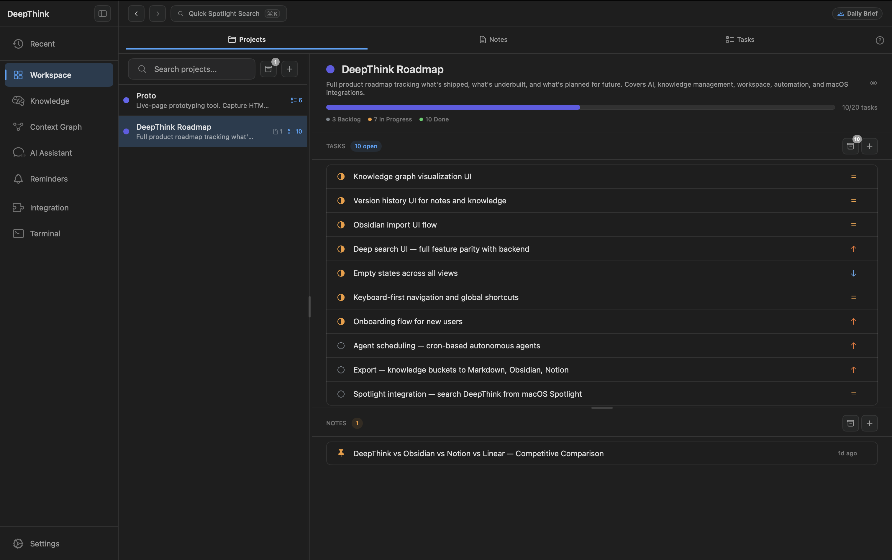
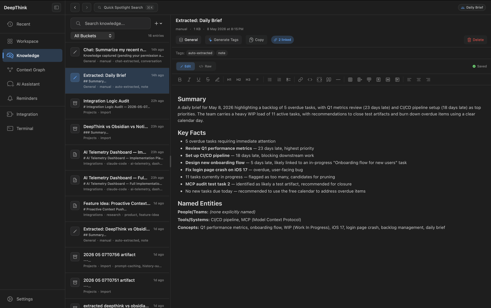
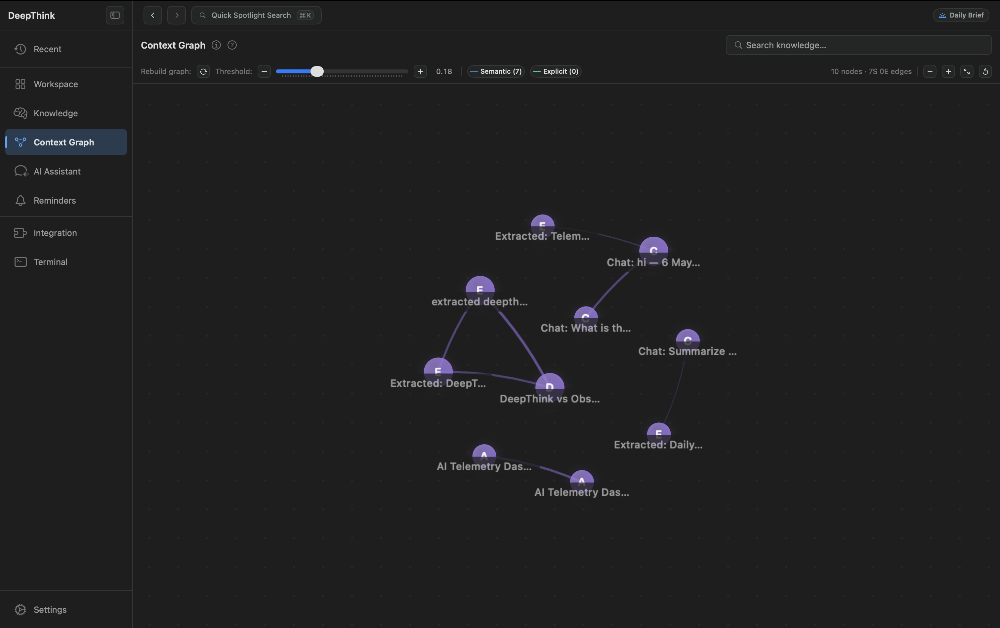
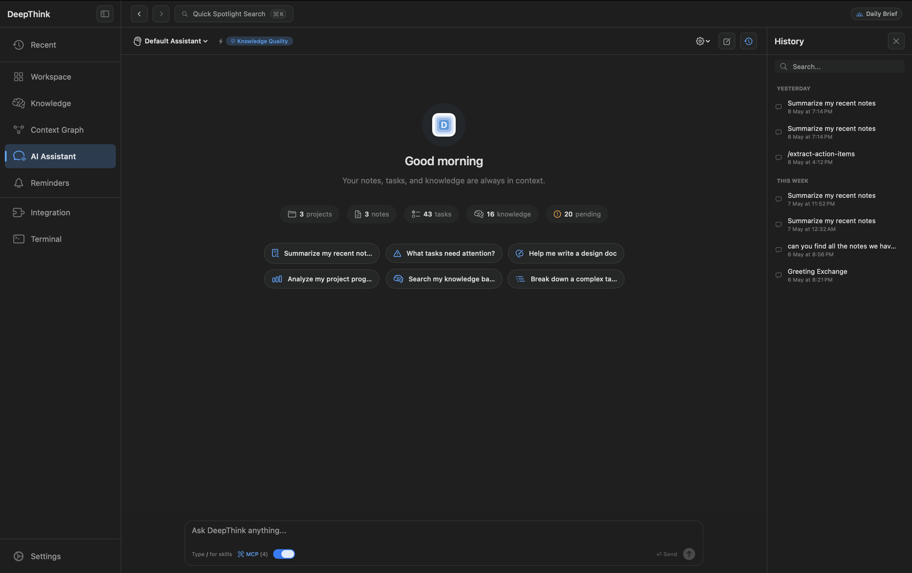
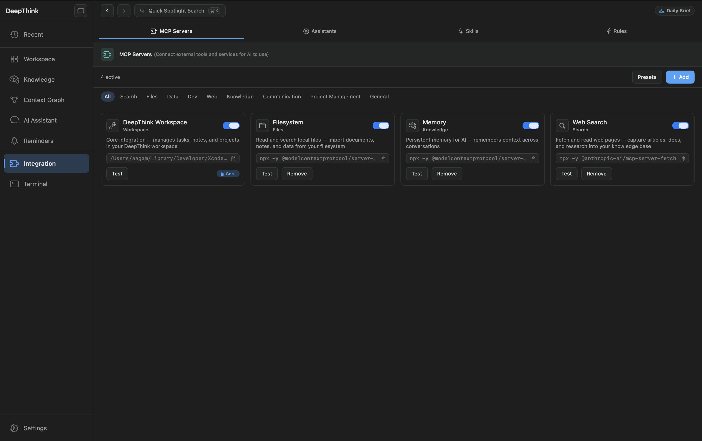
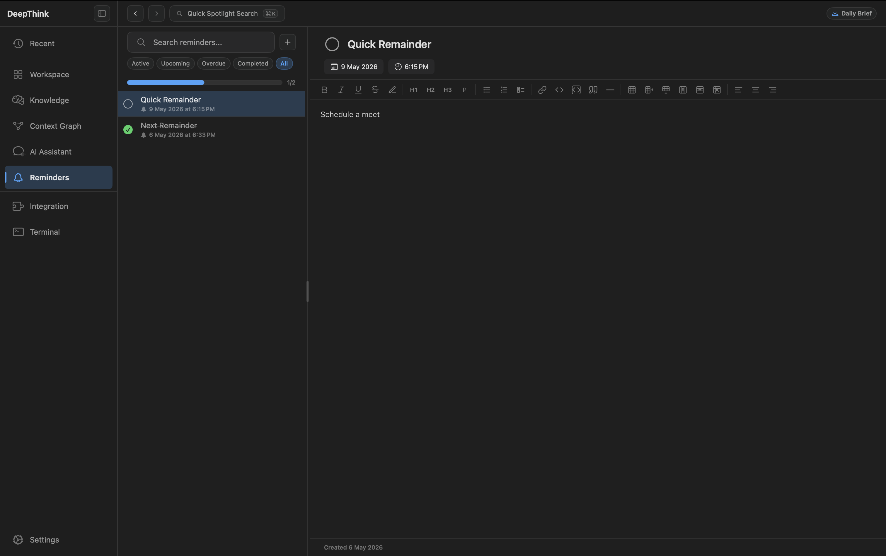
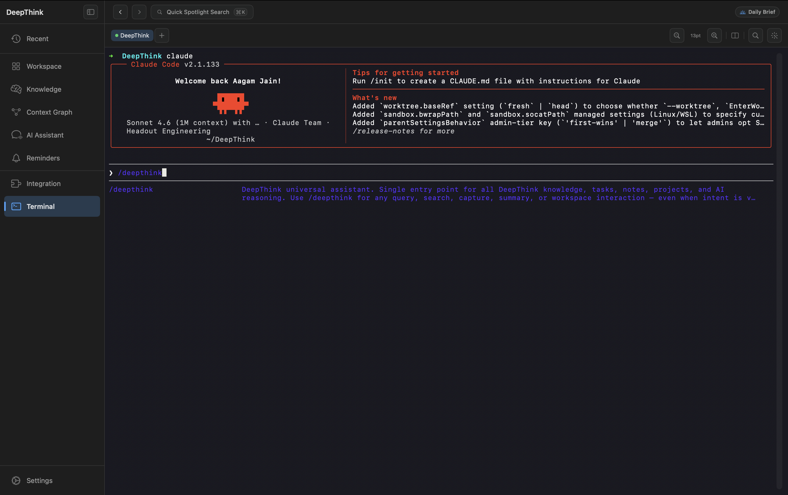
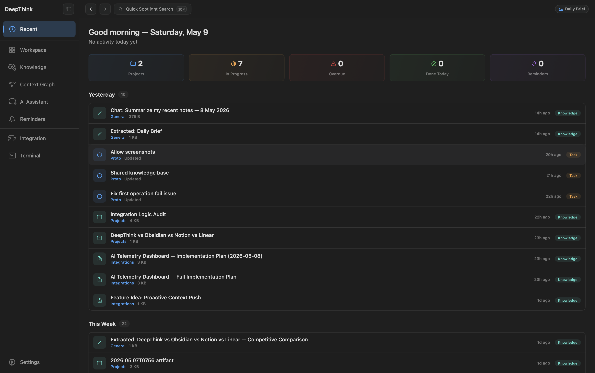
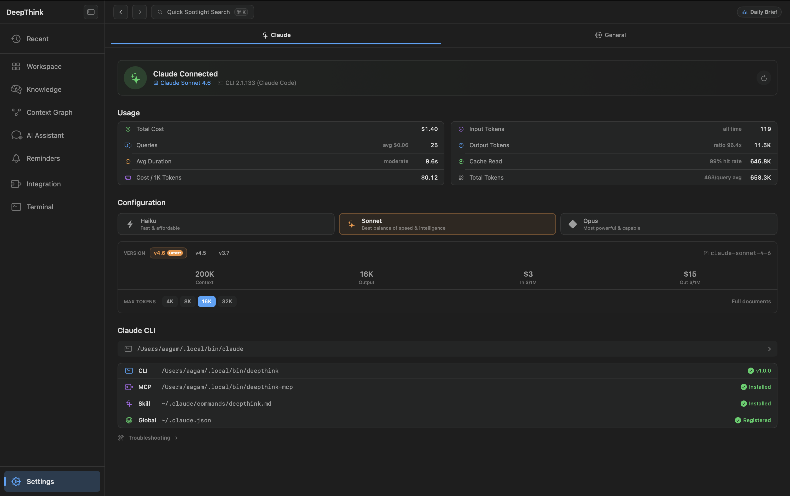

# DeepThink

**The local context layer for AI-assisted development on macOS.**

DeepThink is a local-first workspace-notes, tasks, projects, and a knowledge graph in a native app-plus a **51-tool MCP server** and **CLI** that expose indexed context from `~/DeepThink/` to Cursor, Claude Code, Windsurf, and other MCP hosts. On-device search. No required cloud account. **MIT licensed.**

[](https://github.com/getlost01/deepthink/actions/workflows/ci.yml?query=branch%3Amain)
[](https://github.com/getlost01/deepthink/releases/latest)
[](LICENSE)
[](CONTRIBUTING.md)

```bash
brew tap getlost01/deepthink && brew install --cask deepthink
```

> **macOS 14+** · [Download latest release →](https://github.com/getlost01/deepthink/releases/latest)

<p align="center">
  
</p>

---

## Why DeepThink

Editor-integrated AI is strong at in-session assistance, but context often resets between sessions. DeepThink provides a **durable local layer**: capture once, index on-device, and let agents query your workspace through MCP or the CLI.

| | Generic AI chat | DeepThink |
|---|---|---|
| **Memory across sessions** | Manual context each time | Agents call `smart_query` / `knowledge_context` |
| **Where your data lives** | Vendor cloud or ephemeral chat | `~/DeepThink/` - files you own |
| **Search** | Keyword grep or cloud RAG | Hybrid BM25 + Apple NLEmbedding, fully on-device |
| **Workspace** | Editor-only | Native app: notes, kanban, reminders, knowledge graph |
| **Agent access** | Single IDE | App · CLI · 51-tool MCP - any MCP host |

---

## Quick start

**1. Install and launch** - the CLI and MCP server are installed to `~/.local/bin/` on first launch.

**2. Connect your editor** - one line for Claude Code:

```bash
claude mcp add deepthink -- ~/.local/bin/deepthink-mcp
```

For Cursor / VS Code / Windsurf, add to your MCP config:

```json
{
  "mcpServers": {
    "deepthink": {
      "command": "/Users/yourname/.local/bin/deepthink-mcp"
    }
  }
}
```

**3. Query with context** - connected agents can use 51 tools to list tasks, search knowledge, read project notes, create entries, and more.

```bash
deepthink ask "what's blocked on the API project?"
deepthink context --query "authentication decisions"
```

---

## Built for

| Who | What DeepThink unlocks |
|---|---|
| **Developers using Cursor / Claude Code / Windsurf** | Indexed project context, tasks, and decisions available to agents across sessions |
| **Knowledge workers & researchers** | Capture URLs, RSS, Obsidian vaults; semantic search; context graph for discovery |
| **Solo founders & PMs** | Kanban with story points, reminders, daily brief, slash skills for standups and summaries |
| **Obsidian / local-PKM users** | Import vaults, keep markdown on disk, add hybrid search and agent access without SaaS lock-in |
| **Automation & DevOps** | CLI from cron, git hooks, CI - MCP from any host; audit log on every mutation |

---

## Feature showcase

### Agent memory & automation

| Feature | What it does |
|---|---|
| **51-tool MCP server** | `smart_query`, `unified_search`, `workspace_*`, `knowledge_*`, agents, skills, rules - search tools and edit tools, clearly separated |
| **Model-agnostic CLI** | `deepthink ask`, `run`, `react`, `research`, `schedule` - works without Claude; full audit log on writes |
| **Live sync** | CLI and MCP mutations sync to the running app instantly via Darwin notification |
| **Token-budgeted retrieval** | `smart_query` and `deepthink_overview` return ~200 tokens of the *right* context, not raw dumps |

### Knowledge & search

| Feature | What it does |
|---|---|
| **Hybrid RAG** | BM25 keyword + Apple NLEmbedding semantic search fused via RRF - fully on-device, no cloud index |
| **Smart capture** | URLs, files, folders, RSS, clipboard, Obsidian vaults, and scripted collectors - deduplicated and tagged |
| **Context graph** | Force-directed view of semantic neighbors and wiki-link connections across your entire corpus |
| **Deep Search** | Local hybrid search plus AI analysis for complex questions |

### Workspace & productivity

| Feature | What it does |
|---|---|
| **Projects, notes, tasks** | Kanban with priorities, story points, due dates - all queryable by agents through MCP |
| **Wiki backlinks & version history** | TipTap markdown editor with `[[backlinks]]` and note versioning |
| **⌘K command palette** | Fuzzy jump to any note, project, task, skill, or action from anywhere |
| **Quick capture** | Floating panel for instant note, knowledge entry, or task |
| **Reminders** | Timed alerts with native macOS notifications and smart filters (Today, This Week, …) |
| **Daily Brief (⌘D)** | AI-generated overview of your day from workspace activity |
| **Built-in terminal** | Multi-tab SwiftTerm with AI analysis on scrollback (build errors, logs, etc.) |

### AI chat, agents & skills

| Feature | What it does |
|---|---|
| **AI assistant** | Streaming Claude with workspace awareness, edit branching, and session compaction |
| **Custom agents** | Personas with scoped knowledge, model override, and assigned skills |
| **Skills** | Slash commands (`/standup`, `/summarize`, custom) with template and context injection |
| **Rules** | Auto-injected instructions per project or globally - consistent output without manual prompting |

> In-app AI chat, agents, skills, and rules use the local **Claude CLI** (`claude login`). The MCP server and CLI are fully model-agnostic.

---

## Three surfaces, one store

```text
┌─────────────────┐   ┌─────────────────┐   ┌─────────────────┐
│  macOS app      │   │  deepthink CLI  │   │  deepthink-mcp  │
│  SwiftUI GUI    │   │  scripts, cron  │   │  Cursor, Claude │
└────────┬────────┘   └────────┬────────┘   └────────┬────────┘
         │                     │                     │
         └─────────────────────┼─────────────────────┘
                               ▼
                    ~/DeepThink/  (SQLite + markdown)
                    hybrid index · audit log · trash snapshots
```

---

## Screenshots

<details>
<summary><strong>Explore the app</strong></summary>

<p align="center"></p>
<p align="center"></p>
<p align="center"></p>
<p align="center"></p>
<p align="center"></p>
<p align="center"></p>
<p align="center"></p>
<p align="center"></p>

</details>

---

## Table of contents

- [Why DeepThink](#why-deepthink)
- [Quick start](#quick-start)
- [Built for](#built-for)
- [Feature showcase](#feature-showcase)
- [Three surfaces, one store](#three-surfaces-one-store)
- [Installing](#installing)
- [Using the CLI](#using-the-cli)
- [MCP server](#mcp-server)
- [Architecture](#architecture)
- [Tech stack](#tech-stack)
- [Contributing](#contributing)
- [Documentation](#documentation)
- [License](#license)

---

## Installing

### Option A - Homebrew (recommended)

```bash
brew tap getlost01/deepthink
brew install --cask deepthink
```

First launch: **Right-click → Open**, or clear quarantine manually:

```bash
xattr -rd com.apple.quarantine /Applications/DeepThink.app
```

### Option B - Download from GitHub Releases

1. Download **`DeepThink-macOS.zip`** from [Releases](https://github.com/getlost01/deepthink/releases/latest)
2. Unzip and drag **DeepThink.app** to Applications
3. First launch: **Right-click → Open**
4. If macOS still blocks, clear quarantine:

```bash
# App in Applications
xattr -cr /Applications/DeepThink.app
# App still in Downloads
xattr -cr ~/Downloads/DeepThink.app
```

5. Launch DeepThink - the CLI and MCP server install automatically on first launch
6. Install Claude CLI from [claude.ai/code](https://claude.ai/code) and run `claude login` to enable in-app AI

### Option C - Build from source

**Prerequisites:** macOS 14+, Xcode 16+, [XcodeGen](https://github.com/yonaskolb/XcodeGen), [Bun](https://bun.sh), [Claude CLI](https://claude.ai/code)

```bash
git clone https://github.com/getlost01/deepthink
cd deepthink

# Build CLI + MCP binaries
cd cli && bash build.sh && cd ..

# Generate and open Xcode project
xcodegen generate
open DeepThink.xcodeproj
```

Hit **Run** (⌘R) in Xcode. On first launch the app copies the CLI binaries to `~/.local/bin/` and registers the MCP server with Claude.

---

## Using the CLI

After first launch, `deepthink` is available in your terminal:

```bash
deepthink status                                  # workspace overview
deepthink ask "what's due this week?"
deepthink note "meeting with design team"
deepthink task "fix login bug" --project api
deepthink knowledge capture https://some-article.com
deepthink search "vector embeddings"
deepthink context                                 # current workspace context for any agent
```

Full command reference: [docs/cli/README.md](docs/cli/README.md)

---

## MCP Server

DeepThink ships a full MCP server (`deepthink-mcp`) installed to `~/.local/bin/deepthink-mcp`.

**Use with Claude Code:**

```bash
claude mcp add deepthink -- ~/.local/bin/deepthink-mcp
```

**Use with Cursor / VS Code / Windsurf:**

```json
{
  "mcpServers": {
    "deepthink": {
      "command": "/Users/yourname/.local/bin/deepthink-mcp"
    }
  }
}
```

The MCP server works with **any MCP-compatible AI agent** - Claude is not required. 51 tools across `smart_query`, `unified_search`, `workspace_*`, and `knowledge_*` namespaces: some only search your workspace, others create or edit items. Every change is audited and synced to the app.

Full tool reference: [docs/mcp-integration.md](docs/mcp-integration.md)

---

## Architecture

```text
DeepThink/
├── DeepThinkApp.swift         # app entry point, service startup, onboarding
├── Models/                    # SwiftData models (Note, Task, Project, Reminder, …)
├── Services/                  # 26 @Observable singletons
│   ├── ClaudeService          # Claude CLI subprocess + streaming JSON
│   ├── ContextEngine          # RAG retrieval, workspace context packaging
│   ├── KnowledgeService       # knowledge entry CRUD + file layout
│   ├── VectorStore            # SQLite vector index (Apple NLEmbedding)
│   ├── MCPService             # MCP subprocess management + config
│   ├── InstallationManager    # first-launch CLI/MCP install + PATH setup
│   └── …
├── Views/                     # SwiftUI views organized by feature
│   ├── Shared/                # design system, reusable components
│   ├── Workspace/             # projects, notes, tasks
│   ├── Knowledge/             # knowledge browser, Obsidian import
│   ├── Chat/                  # AI chat, history, bubbles
│   ├── Settings/              # Claude, general, backup settings
│   └── …
└── Utilities/                 # constants, extensions, error types

cli/
├── src/index.ts               # CLI entrypoint (Bun)
├── src/mcp-server.ts          # MCP server (stdio transport; 51 tools in src/tools/*)
├── src/agents/                # 13 autonomous agents (research, planner, react, writer, …)
├── src/memory/                # agent memory manager + compressor
├── src/tools/                 # workspace, knowledge, config, analytics, search tools
└── src/core/                  # db, embedding, vector-store, context-engine, llm

~/DeepThink/                   # all user data - no iCloud, no backend
├── data/deepthink.store       # SwiftData SQLite database
├── data/vectors.db            # vector embeddings (SQLite)
├── knowledge/                 # knowledge entries as markdown files
└── logs/                      # app + CLI logs
```

---

## Tech stack

| Layer | Technology |
|-------|-----------|
| App | Swift 5 / SwiftUI / AppKit / macOS 14+ |
| Persistence | SwiftData + SQLite (WAL mode) |
| Embeddings | Apple NaturalLanguage framework (`NLEmbedding`) - fully on-device |
| Terminal | [SwiftTerm](https://github.com/migueldeicaza/SwiftTerm) |
| Updates | [Sparkle](https://github.com/sparkle-project/Sparkle) 2 |
| Editor | TipTap (ProseMirror) compiled to a WKWebView bundle |
| CLI / MCP | Bun + TypeScript, compiled to single binaries |
| AI | Anthropic Claude CLI (streaming JSON, local subprocess) |

---

## Contributing

DeepThink is **open source (MIT)**. Read [CONTRIBUTING.md](CONTRIBUTING.md) first.

```bash
git clone https://github.com/getlost01/deepthink
cd deepthink
cd cli && bash build.sh && cd ..
xcodegen generate
open DeepThink.xcodeproj
```

Code style: **SwiftFormat** (`.swiftformat`) and **SwiftLint** (`.swiftlint.yml`) run as Xcode pre-build scripts.

```bash
brew install swiftformat swiftlint
```

All new UI must use `DS.*` tokens from `DeepThink/Views/Shared/DesignSystem.swift` - no raw colors, fonts, or spacing values. See [DESIGN_SYSTEM.md](DESIGN_SYSTEM.md).

**Issues & good first issues:** [github.com/getlost01/deepthink/issues](https://github.com/getlost01/deepthink/issues)

---

## Documentation

| | |
|-|-|
| [App Features](docs/app/README.md) | Workspace, knowledge, AI chat, terminal, quick capture |
| [CLI Reference](docs/cli/README.md) | All `deepthink` commands, agent system |
| [MCP Integration](docs/mcp-integration.md) | 51 MCP tools, external client setup |
| [Architecture](docs/ARCHITECTURE.md) | System design, service layer, data flow |
| [RAG Pipeline](docs/rag-pipeline.md) | Hybrid BM25 + semantic retrieval |
| [Storage](docs/storage.md) | Data directory layout, database schema |
| [Keyboard Shortcuts](docs/shortcuts.md) | Full shortcuts reference |
| [Contributing](CONTRIBUTING.md) | Build guide, code style, PR workflow |
| [Security](SECURITY.md) | Reporting vulnerabilities |

---

## License

[MIT](LICENSE)
