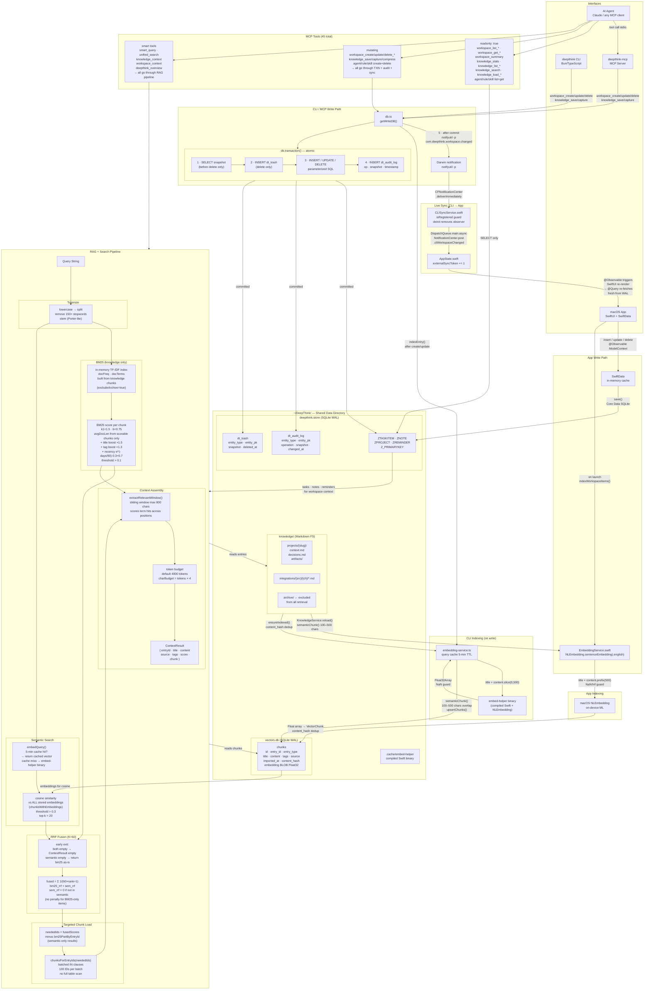

# DeepThink — Full System Flow Diagram

End-to-end data flow across the macOS app, CLI, MCP server, RAG pipeline, and live sync.

```mermaid
flowchart TB
    subgraph INTERFACES["Interfaces"]
        APP["macOS App\nSwiftUI + SwiftData"]
        CLI["deepthink CLI\nBun/TypeScript"]
        MCP["deepthink-mcp\nMCP Server"]
        AI["AI Agent\nClaude / any MCP client"]
    end

    subgraph DISK["~/DeepThink/ — Shared Data Directory"]
        subgraph STORE["deepthink.store (SQLite WAL)"]
            ENTITIES["ZTASKITEM · ZNOTE\nZPROJECT · ZREMINDER\nZ_PRIMARYKEY"]
            AUDIT["dt_audit_log\nentity_type · entity_pk\noperation · snapshot · changed_at"]
            TRASH["dt_trash\nentity_type · entity_pk\nsnapshot · deleted_at"]
        end
        subgraph VDB["vectors.db (SQLite WAL)"]
            CHUNKS["chunks\nid · entry_id · entry_type\ntitle · content · tags · source\nimported_at · content_hash\nembedding BLOB Float32"]
        end
        subgraph KFS["knowledge/ (Markdown FS)"]
            KPROJ["projects/{slug}/\ncontext.md\ndecisions.md\nartifacts/"]
            KINT["integrations/{src}/{ch}/*.md"]
            KARCH["archive/ ← excluded\nfrom all retrieval"]
        end
        CACHE[".cache/embed-helper\ncompiled Swift binary"]
    end

    subgraph APP_WRITE["App Write Path"]
        APP -->|"insert / update / delete\n@Observable ModelContext"| SD["SwiftData\nin-memory cache"]
        SD -->|"save()\nCore Data SQLite"| ENTITIES
        APP -->|"on launch\nindexWorkspaceItems()"| EMB_APP
    end

    subgraph APP_INDEX["App Indexing"]
        EMB_APP["EmbeddingService.swift\nNLEmbedding.sentenceEmbedding(.english)"]
        EMB_APP -->|"title + content.prefix(500)\nNaN/Inf guard"| NL_APP["macOS NLEmbedding\non-device ML"]
        NL_APP -->|"Float array → VectorChunk\ncontent_hash dedup"| CHUNKS
        KFS -->|"KnowledgeService.reload()\nsemanticChunk() 100–500 chars"| EMB_APP
    end

    subgraph CLI_WRITE["CLI / MCP Write Path"]
        AI -->|"tool call stdio"| MCP
        MCP & CLI -->|"workspace_create/update/delete\nknowledge_save/capture"| DBT

        DBT["db.ts\ngetWriteDB()"]

        subgraph TXN["db.transaction() — atomic"]
            T1["1 · SELECT snapshot\n(before delete only)"]
            T2["2 · INSERT dt_trash\n(delete only)"]
            T3["3 · INSERT / UPDATE / DELETE\nparameterized SQL"]
            T4["4 · INSERT dt_audit_log\nop · snapshot · timestamp"]
            T1 --> T2 --> T3 --> T4
        end

        DBT --> TXN
        TXN -->|"committed"| ENTITIES
        TXN -->|"committed"| AUDIT
        TXN -->|"committed"| TRASH

        DBT -->|"5 · after commit\nnotifyutil -p\ncom.deepthink.workspace.changed"| DARWIN
    end

    subgraph CLI_INDEX["CLI Indexing (on write)"]
        DBT -->|"indexEntry()\nafter create/update"| EMB_CLI["embedding-service.ts\nquery cache 5-min TTL"]
        EMB_CLI -->|"title + content.slice(0,500)"| HELPER["embed-helper binary\n(compiled Swift + NLEmbedding)"]
        HELPER -->|"Float32Array\nNaN guard"| EMB_CLI
        EMB_CLI -->|"semanticChunk()\n100–500 chars overlap\nupsertChunks()"| CHUNKS
        KFS -->|"ensureIndexed()\ncontent_hash dedup"| EMB_CLI
    end

    subgraph SYNC["Live Sync: CLI → App"]
        DARWIN["Darwin notification\nnotifyutil -p"]
        DARWIN -->|"CFNotificationCenter\n.deliverImmediately"| CLISYNC["CLISyncService.swift\nisRegistered guard\ndeinit removes observer"]
        CLISYNC -->|"DispatchQueue.main.async\nNotificationCenter.post\n.cliWorkspaceChanged"| APPSTATE["AppState.swift\nexternalSyncToken += 1"]
        APPSTATE -->|"@Observable triggers\nSwiftUI re-render\n→ @Query re-fetches\nfresh from WAL"| APP
    end

    subgraph RAG["RAG + Search Pipeline"]
        QUERY["Query String"]

        subgraph TOKENIZE["Tokenize"]
            TOK["lowercase → split\nremove 150+ stopwords\nstem (Porter-lite)"]
        end

        subgraph BM25_PIPE["BM25 (knowledge only)"]
            TFIDF["in-memory TF-IDF index\ndocFreq · docTerms\nbuilt from knowledge chunks\n(excludeArchive=true)"]
            BM25_SCORE["BM25 score per chunk\nk1=1.5 · b=0.75\navgDocLen from scorable chunks only\n+ title boost ×1.5\n+ tag boost ×1.3\n+ recency e^(-days/90)·0.3+0.7\nthreshold > 0.1"]
        end

        subgraph SEM_PIPE["Semantic Search"]
            QEMBED["embedQuery()\n5-min cache hit?\n→ return cached vector\ncache miss → embed-helper binary"]
            COSINE["cosine similarity\nvs ALL stored embeddings\n(chunksWithEmbeddings)\nthreshold > 0.3\ntop-k = 20"]
        end

        subgraph RRF_PIPE["RRF Fusion (K=60)"]
            RRF_SCORE["fused = Σ 1/(60+rank+1)\nbm25_rrf + sem_rrf\nsem_rrf = 0 if not in semantic\n(no penalty for BM25-only items)"]
            EARLY["early exit:\nboth empty → ContextResult empty\nsemantic empty → return bm25 as-is"]
        end

        subgraph CHUNK_LOAD["Targeted Chunk Load"]
            NEEDED["neededIds = fusedScores\n  minus bm25PartByEntryId\n(semantic-only results)"]
            CFE["chunksForEntryIds(neededIds)\nbatched IN clauses\n100 IDs per batch\nno full table scan"]
        end

        subgraph ASSEMBLE["Context Assembly"]
            WIN["extractRelevantWindow()\nsliding window max 800 chars\nscores term hits across positions"]
            BUDGET["token budget\ndefault 4000 tokens\ncharBudget = tokens × 4"]
            OUT["ContextResult\n{ entryId · title · content\n  source · tags · score · chunk }"]
        end

        QUERY --> TOK
        TOK --> TFIDF --> BM25_SCORE
        TOK --> QEMBED --> COSINE
        BM25_SCORE & COSINE --> EARLY
        EARLY --> RRF_SCORE
        RRF_SCORE --> NEEDED --> CFE
        BM25_SCORE --> WIN
        CFE --> WIN
        WIN --> BUDGET --> OUT
    end

    subgraph MCP_TOOLS["MCP Tools (45 total)"]
        RO_TOOLS["readonly: true\nworkspace_list_* · workspace_get_*\nworkspace_summary\nknowledge_stats · knowledge_list_*\nknowledge_search · knowledge_load_*\nagent/rule/skill list+get"]
        MUT_TOOLS["mutating\nworkspace_create/update/delete_*\nknowledge_save/capture/compress\nagent/rule/skill create+delete\n→ all go through TXN + audit + sync"]
        SMART_TOOLS["smart tools\nsmart_query · unified_search\nknowledge_context\nworkspace_context\ndeepthink_overview\n→ all go through RAG pipeline"]
    end

    AI --> RO_TOOLS & MUT_TOOLS & SMART_TOOLS
    RO_TOOLS -->|"SELECT only"| ENTITIES
    MUT_TOOLS --> DBT
    SMART_TOOLS --> RAG
    RAG -->|"reads chunks"| CHUNKS
    RAG -->|"reads entries"| KFS
    CHUNKS -->|"embeddings for cosine"| COSINE
    ENTITIES -->|"tasks · notes · reminders\nfor workspace context"| RAG
```
